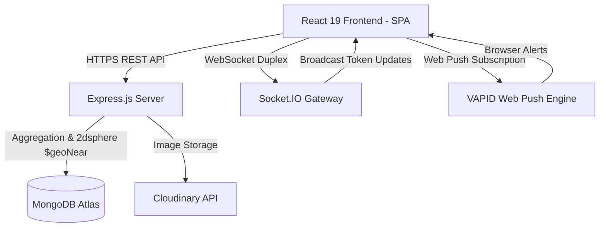

# QueueWise — Real-Time Virtual Queue & Geospatial Discovery Platform

[](https://queuewise-omega.vercel.app)
[](https://github.com/Swaraj49/Queuewise.git)
[](https://react.dev/)
[](https://nodejs.org/)
[](https://www.mongodb.com/)
[](https://socket.io/)
[](https://tailwindcss.com/)

**QueueWise** is an enterprise-grade, real-time virtual queue management and geospatial shop discovery web application. Designed to eliminate physical waiting lines for businesses and customers alike, QueueWise allows users to discover nearby stores on an interactive map, join virtual queues remotely, receive real-time queue position updates via WebSockets, and get instant VAPID Web Push notifications when it's their turn.

---

## 🌟 Key Features

### 👤 For Customers / Queue Joiners
- 📍 **Geospatial Store Discovery**: Interactive Leaflet map powered by MongoDB `2dsphere` spatial indexing for instant location-based store lookup with custom radius filtering (5 km to 50 km).
- 🎫 **Virtual Token Generation**: Join queue instantly with unique token generation and live ETA calculation based on average service time per customer.
- ⚡ **Real-Time Live Status**: Bi-directional status updates via **Socket.IO** — watch your position in line update live without refreshing the page.
- 🔔 **VAPID Web Push Notifications**: Receive browser-level push notifications even when the browser tab is in the background or minimized when your turn arrives.
- 📜 **Queue History & Pass**: View past active and completed tokens with single-click QR/Pass view.

### 🏢 For Business Owners / Merchants
- 📊 **Real-Time Merchant Dashboard**: Full-width live dashboard for managing queue flow, advancing tokens (`Serving`, `Completed`, `Cancelled`, `No-Show`).
- 🏬 **Storefront & Service Management**: Add/edit shop details, working hours, address, operating category, and customized max queue limits.
- 🖼️ **Cloud Image Uploads**: Cloudinary integration for smooth storefront banner and photo management.
- ⏱️ **Automated No-Show Timeout**: Automatic background cleanup timers to transition stagnant tokens and prevent queue bottlenecks.
- 📈 **Queue Analytics**: Track total served daily, average wait time, and queue completion rates.

---

## 🏗️ Tech Stack & Architecture

### **Frontend**
- **Framework**: React 19 (built with Vite)
- **Styling**: Tailwind CSS, Lucide Icons, Framer Motion
- **Maps & Geospatial**: Leaflet / React-Leaflet
- **Real-Time**: Socket.IO Client
- **Push Alerts**: Service Worker + Web Push API (VAPID)
- **Routing**: React Router DOM v7

### **Backend**
- **Runtime**: Node.js & Express.js
- **Database**: MongoDB (Mongoose ODM) with `2dsphere` geospatial index on `[longitude, latitude]`
- **Real-Time Engine**: Socket.IO WebSockets with dedicated rooms per store (`store_<storeId>`)
- **Push Engine**: `web-push` library with VAPID keys
- **Auth**: JSON Web Tokens (JWT) & bcryptjs password hashing
- **Media Storage**: Cloudinary SDK & Multer middleware

---

## 📐 System Architecture



---

## 📁 Repository Structure

```text
queuewise/
├── client/                      # Frontend Vite + React application
│   ├── public/                  # Static assets & Service Worker (sw.js)
│   ├── src/
│   │   ├── components/          # Reusable UI components (Navbar, ProtectedRoute, etc.)
│   │   ├── context/             # React Auth & Socket Context Providers
│   │   ├── pages/               # Pages (Home, Discover, Dashboard, QueueStatus, Login, Register)
│   │   ├── utils/               # Axios instance, VAPID helper functions
│   │   ├── App.jsx              # Main routing and dynamic layout wrapper
│   │   └── main.jsx             # Entry point
│   ├── vercel.json              # Vercel SPA single-page routing rewrite config
│   └── package.json
│
└── server/                      # Backend Node.js + Express application
    ├── config/                  # DB and Cloudinary connection configs
    ├── controllers/             # Auth, Store, Queue, Analytics controllers
    ├── middleware/              # Auth middleware & error handlers
    ├── models/                  # Mongoose models (User, Store, QueueToken)
    ├── routes/                  # Express API routes
    ├── utils/                   # WebPush & Socket initialization utilities
    ├── server.js                # Server entry point & Socket.IO server initialization
    └── package.json
```

---

## ⚡ Quick Start / Local Installation

### Prerequisites
- [Node.js](https://nodejs.org/) (v18 or higher)
- [MongoDB](https://www.mongodb.com/) (Local instance or MongoDB Atlas URI)
- Cloudinary Account (for image uploads)

---

### 1. Clone the Repository
```bash
git clone https://github.com/Swaraj49/Queuewise.git
cd queuewise
```

---

### 2. Backend Setup (`server`)

1. Navigate to the server folder:
   ```bash
   cd server
   ```

2. Install dependencies:
   ```bash
   npm install
   ```

3. Create a `.env` file in `server/.env`:
   ```env
   PORT=5000
   MONGO_URI=mongodb+srv://<username>:<password>@cluster0.mongodb.net/queuewise?retryWrites=true&w=majority
   JWT_SECRET=your_super_secret_jwt_key
   CLIENT_URL=http://localhost:5173

   # Web Push (VAPID) Keys
   VAPID_PUBLIC_KEY=your_vapid_public_key
   VAPID_PRIVATE_KEY=your_vapid_private_key

   # Cloudinary Setup
   CLOUDINARY_CLOUD_NAME=your_cloud_name
   CLOUDINARY_API_KEY=your_api_key
   CLOUDINARY_API_SECRET=your_api_secret

   # Queue Settings
   NO_SHOW_TIMEOUT_MINUTES=15
   ```

4. Start the backend server:
   ```bash
   npm run dev
   ```
   The backend will run on `http://localhost:5000`.

---

### 3. Frontend Setup (`client`)

1. Open a new terminal and navigate to the client folder:
   ```bash
   cd client
   ```

2. Install dependencies:
   ```bash
   npm install
   ```

3. Create a `.env` file in `client/.env`:
   ```env
   VITE_API_BASE_URL=http://localhost:5000
   ```

4. Start the Vite dev server:
   ```bash
   npm run dev
   ```
   Open `http://localhost:5173` in your browser.

---

## 🔑 Environment Variables Reference

### Backend (`server/.env`)
| Variable | Description | Default / Example |
| :--- | :--- | :--- |
| `PORT` | Backend server port | `5000` |
| `MONGO_URI` | MongoDB Connection String | `mongodb+srv://...` |
| `JWT_SECRET` | Secret key for JWT signing | `your_jwt_secret` |
| `CLIENT_URL` | Allowed CORS client origin | `http://localhost:5173` or `https://queuewise-omega.vercel.app` |
| `VAPID_PUBLIC_KEY` | Public key for browser web push alerts | Generated via `web-push generate-vapid-keys` |
| `VAPID_PRIVATE_KEY` | Private key for server web push alerts | Generated via `web-push generate-vapid-keys` |
| `CLOUDINARY_CLOUD_NAME` | Cloudinary Account Cloud Name | Cloudinary dashboard |
| `CLOUDINARY_API_KEY` | Cloudinary API Key | Cloudinary dashboard |
| `CLOUDINARY_API_SECRET` | Cloudinary API Secret | Cloudinary dashboard |

### Frontend (`client/.env`)
| Variable | Description | Default / Example |
| :--- | :--- | :--- |
| `VITE_API_BASE_URL` | Base URL of deployed Express backend | `http://localhost:5000` or Render API URL |

---

## 🚀 Deployment Guide

### **Frontend (Vercel)**
1. Connect your repository to Vercel and set the root directory to `client`.
2. Add Environment Variable:
   - `VITE_API_BASE_URL`: `https://your-backend-service.onrender.com`
3. Ensure `vercel.json` exists in `client/` for routing fallback:
   ```json
   {
     "rewrites": [
       { "source": "/(.*)", "destination": "/index.html" }
     ]
   }
   ```

### **Backend (Render / Railway / Cyclic)**
1. Deploy `server/` directory as a Web Service.
2. Build command: `npm install`
3. Start command: `node server.js`
4. Configure all environment variables listed in the `.env` reference above, setting `CLIENT_URL` to your Vercel domain (`https://queuewise-omega.vercel.app`).

---

## 🤝 Contributing

Contributions, issues, and feature requests are welcome!  
Feel free to check the [issues page](https://github.com/Swaraj49/Queuewise/issues).

1. Fork the Project
2. Create your Feature Branch (`git checkout -b feature/AwesomeFeature`)
3. Commit your Changes (`git commit -m 'Add some AwesomeFeature'`)
4. Push to the Branch (`git push origin feature/AwesomeFeature`)
5. Open a Pull Request

---

## 📄 License

Distributed under the MIT License. See `LICENSE` for more information.

---

## 👨‍💻 Author

**Swaraj**  
- GitHub: [@Swaraj49](https://github.com/Swaraj49)
- Live App: [QueueWise Live](https://queuewise-omega.vercel.app)
